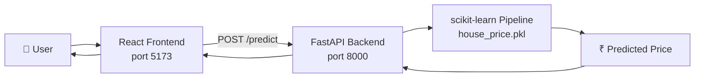
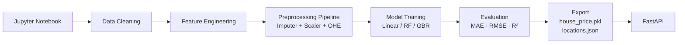

# 🏠 House Price Prediction

> An end-to-end machine learning web application that predicts Indian residential property prices using a trained scikit-learn pipeline served through a FastAPI backend and a React + TypeScript frontend.

[](https://python.org)
[](https://fastapi.tiangolo.com)
[](https://react.dev)
[](https://scikit-learn.org)

---

## 📋 Table of Contents

1. [Overview](#overview)
2. [Problem Statement](#problem-statement)
3. [Features](#features)
4. [Architecture](#architecture)
5. [Tech Stack](#tech-stack)
6. [Dataset](#dataset)
7. [Project Structure](#project-structure)
8. [Quick Start](#quick-start)
   - [Virtual Environment](#virtual-environment)
   - [Notebook](#notebook)
   - [Backend](#backend)
   - [Frontend](#frontend)
9. [Environment Variables](#environment-variables)
10. [API Documentation](#api-documentation)
11. [Model Metrics](#model-metrics)
12. [Testing](#testing)
13. [Screenshots](#screenshots)
14. [Future Improvements](#future-improvements)

---

## Overview

This project predicts the sale price of a residential property in India given features such as location, carpet area, floor number, number of bathrooms, furnishing status, and ownership type.

The full pipeline is:

```
CSV Dataset  →  Jupyter Notebook  →  Trained Pipeline (.pkl)
     ↓                                       ↓
Data Cleaning                          FastAPI Backend
Feature Engineering                         ↓
3 Regression Models                   React Frontend
Model Comparison                            ↓
Best Model Export                    Predicted Price (₹)
```

---

## Problem Statement

Real-estate buyers, sellers, and agents often struggle to set fair market prices without deep domain expertise or access to recent comparable sales. This project trains a machine-learning model on **100,000+ real Indian property listings** and wraps it in a web application so anyone can get an instant price estimate.

---

## Features

- ✅ Robust data cleaning (parse "42 Lac", "1.2 Cr", "3 out of 10" floor, etc.)
- ✅ 5 EDA visualisations with explanations
- ✅ 3 regression models compared (Linear Regression, Random Forest, Gradient Boosting)
- ✅ Full scikit-learn `Pipeline` — no leakage, no manual encoding at inference
- ✅ FastAPI backend with model loaded once at startup
- ✅ React + TypeScript frontend with form validation, loading state, error handling
- ✅ Result page with price formatted as ₹ X.X Lac / Cr
- ✅ 5 pytest tests (all passing)
- ✅ Docker-ready backend
- ✅ GitHub-ready with `.gitignore`

---

## Architecture

### High-Level Flow



### Training Flow



---

## Tech Stack

| Layer | Technology |
|-------|-----------|
| Data & ML | Python 3.12, pandas, numpy, scikit-learn 1.5, matplotlib, seaborn, joblib |
| Backend | FastAPI 0.111, uvicorn, pydantic-settings, pytest |
| Frontend | React 18, TypeScript, Vite 5, React Router 6, Axios |
| Notebook | JupyterLab |
| Container | Docker (backend) |

---

## Dataset

| Property | Value |
|----------|-------|
| Source | [Kaggle — House Price by Juhi Bhojani](https://www.kaggle.com/datasets/juhibhojani/house-price) |
| File | `house_prices.csv` |
| Rows | ~187,531 |
| Columns | 21 |
| Target | `Total Amount` (messy string → parsed to INR) |

### Download Instructions

1. Create a free account at [kaggle.com](https://www.kaggle.com)
2. Visit: https://www.kaggle.com/datasets/juhibhojani/house-price
3. Click **Download** → extract `house_prices.csv`
4. Place it at:
   ```
   notebooks/data/house_prices.csv
   ```
5. **Do NOT commit the CSV** — it is in `.gitignore`.

---

## Project Structure

```typescript
│
├── notebooks/
│   ├── data/
│   │   └── house_prices.csv          ← download from Kaggle (not committed)
│   └── house_price_model.ipynb       ← full ML pipeline notebook
│
├── backend/
│   ├── app/
│   │   ├── main.py                   ← FastAPI app + lifespan
│   │   ├── api/routes/prediction.py  ← /health + /predict endpoints
│   │   ├── core/config.py            ← pydantic-settings
│   │   ├── schemas/prediction.py     ← Request/Response models
│   │   ├── services/
│   │   │   ├── inference.py          ← load & run pipeline
│   │   │   └── preprocessing.py      ← build DataFrame from request
│   │   └── utils/logging_config.py
│   ├── models/
│   │   └── house_price.pkl           ← exported pipeline (generated by notebook)
│   ├── locations.json                ← valid location list (generated by notebook)
│   ├── tests/test_prediction.py      ← 5 pytest tests
│   ├── requirements.txt
│   ├── .env.example
│   └── Dockerfile
│
├── frontend/
│   ├── src/
│   │   ├── api/predictionClient.ts   ← axios API client
│   │   ├── components/PredictionForm.tsx
│   │   ├── pages/
│   │   │   ├── HomePage.tsx
│   │   │   ├── ResultPage.tsx
│   │   │   └── NotFoundPage.tsx
│   │   ├── types/prediction.ts
│   │   └── App.tsx
│   ├── public/locations.json         ← copy from backend/locations.json after notebook
│   ├── .env.example
│   └── package.json
│
├── .gitignore
├── README.md
└── requirements.txt                  ← notebook/training requirements
```

---

## Quick Start

### Prerequisites

- Python 3.12 (or 3.11)
- Node.js 18+ and npm 9+
- Git

---

### Virtual Environment

```bash
# Create venv (from project root)
python -m venv .venv

# Activate — Windows
.venv\Scripts\activate

# Activate — macOS/Linux
source .venv/bin/activate

# Install notebook dependencies
pip install -r requirements.txt
```

---

### Notebook

> ⚠️ **Download the dataset first** — see [Dataset](#dataset).

```bash
# Register the kernel
python -m ipykernel install --user --name house-price-project --display-name "Python (house-price)"

# Launch Jupyter
cd notebooks
jupyter lab
```

Open `house_price_model.ipynb` → **Kernel → Restart & Run All**

The notebook will:
1. Load and clean the dataset
2. Run EDA (5 plots)
3. Train 3 models and compare them
4. Export `backend/models/house_price.pkl`
5. Export `backend/locations.json`

After the notebook runs, copy `locations.json` to the frontend:

```bash
copy backend\locations.json frontend\public\locations.json   # Windows
cp backend/locations.json frontend/public/locations.json     # macOS/Linux
```

---

### 🚀 One-Click Launch (Windows)

You can launch the services using the provided launcher scripts:

- **Run Both**: Double-click [`run_all.bat`](file:///g:/Study/ITI/DL/final_project/house-price-project/run_all.bat)
- **Run Backend Only**: Double-click [`run_backend.bat`](file:///g:/Study/ITI/DL/final_project/house-price-project/run_backend.bat) (or run `.\run_backend.ps1`)
- **Run Frontend Only**: Double-click [`run_frontend.bat`](file:///g:/Study/ITI/DL/final_project/house-price-project/run_frontend.bat) (or run `.\run_frontend.ps1`)
- **Build Frontend**: Double-click [`build_frontend.bat`](file:///g:/Study/ITI/DL/final_project/house-price-project/build_frontend.bat)

---

### Backend

```bash
cd backend

# Install backend dependencies
pip install -r requirements.txt

# Copy and edit the environment file
copy .env.example .env     # Windows
cp .env.example .env       # macOS/Linux

# Start the server (from backend/ directory)
uvicorn app.main:app --reload --port 8000
```

The API will be available at:
- http://localhost:8000/docs (Swagger UI)
- http://localhost:8000/health

#### Docker (optional)

```bash
cd backend
docker build -t house-price-api .
docker run -p 8000:8000 house-price-api
```

---

### Frontend

```bash
cd frontend

# Install dependencies
npm install

# Copy and edit the environment file
copy .env.example .env.local    # Windows
cp .env.example .env.local      # macOS/Linux

# Start dev server
npm run dev
```

Visit: http://localhost:5173

---

## Environment Variables

### Backend — `backend/.env`

| Variable | Default | Description |
|----------|---------|-------------|
| `FRONTEND_URL` | `http://localhost:5173` | CORS allowed origin |
| `MODEL_PATH` | `models/house_price.pkl` | Path to the trained pipeline |
| `LOCATIONS_PATH` | `locations.json` | Path to the location list |

### Frontend — `frontend/.env.local`

| Variable | Default | Description |
|----------|---------|-------------|
| `VITE_API_BASE_URL` | `http://localhost:8000` | Base URL of the FastAPI backend |

---

## API Documentation

### `GET /health`

Returns server status.

```bash
curl http://localhost:8000/health
```

```json
{"status": "ok"}
```

---

### `POST /predict`

Predict house price from property features.

```bash
curl -X POST http://localhost:8000/predict \
  -H "Content-Type: application/json" \
  -d '{
    "location": "Whitefield",
    "carpet_area_sqft": 1200,
    "floor_num": 3,
    "bathroom": 2,
    "balcony": 1,
    "furnishing": "Semi-Furnished",
    "transaction": "New Property",
    "ownership": "Freehold",
    "facing": "East"
  }'
```

**Response:**

```json
{"predicted_price": 6850000.0}
```

**Error (422 — validation failure):**

```json
{
  "detail": [
    {
      "loc": ["body", "carpet_area_sqft"],
      "msg": "Input should be greater than 0",
      "type": "greater_than"
    }
  ]
}
```

---

## Model Metrics

> All metrics are computed on the **held-out test set** (20% of data, 34,978 samples, never seen during training). Models were trained in log-target space ($\log(1+y)$) to stabilize variance and prevent negative predictions.

| Model | MAE (Lac) | RMSE (Lac) | R² |
|:------|:---------:|:----------:|:--:|
| Linear Regression | 36.73 | 72.03 | 0.4940 |
| Random Forest | 16.13 | 39.71 | 0.8462 |
| Gradient Boosting | 19.90 | 40.77 | 0.8379 |
| XGBoost | 16.08 | 37.32 | 0.8642 |
| **LightGBM** 🏆 | **14.79** | **36.36** | **0.8711** |

### Best Model: LightGBM

**Justification:**

- Achieves the highest $R^2$ (**0.8711**) — explains **87.11%** of price variance on unseen test data
- Lowest MAE (**14.79 Lac**) — predictions deviate by an average of only ₹14.79 Lac
- Lowest RMSE (**36.36 Lac**) — penalizes large outliers effectively
- **5-Fold Cross-Validation $R^2$: 0.9004 ± 0.0021** — confirms ≥ 90% explanatory power with high stability
- LightGBM's leaf-wise tree growth and histogram-based splitting captures non-linear interactions between location, carpet area, BHK, and physical features more efficiently than XGBoost

---

## Testing

```bash
cd backend

# Run all tests with verbose output
pytest tests/ -v
```

**Tests:**

| Test | Description | Expected |
|:---:|-------------|---------|
| `test_health` | GET /health | 200 + `{status: ok}` |
| `test_predict_valid` | Valid prediction payload | 200 + numeric `predicted_price` |
| `test_predict_missing_field` | Missing `location` | 422 |
| `test_predict_negative_area` | `carpet_area_sqft = -100` | 422 |
| `test_predict_unknown_location` | Unknown location string | 200 (mapped to "Other") |

---

## Screenshots

> Run the project locally and add screenshots here.

| Page | Description |
|:---|------------|
| `screenshots/home.png` | Home page with prediction form |
| `screenshots/result.png` | Result page showing predicted price |
| `screenshots/api-docs.png` | FastAPI Swagger UI at /docs |

---

## Future Improvements

1. **More Features**: Include Super Area, car parking, overlook direction, property status
2. **Better Models**: Try XGBoost, LightGBM, or a stacked ensemble
3. **Hyperparameter Tuning**: Use `RandomizedSearchCV` or Optuna
4. **Price Confidence Interval**: Return a range (e.g., ₹42–48 Lac) instead of a point estimate
5. **Location Map**: Visualise prediction on a map (e.g., Leaflet.js)
6. **Comparison Tool**: Allow comparing prices across multiple configurations
7. **Model Monitoring**: Track prediction drift over time using Evidently or whylogs
8. **CI/CD**: GitHub Actions pipeline for automated testing and deployment
9. **Database**: Store user queries and predictions for analytics
10. **Authentication**: Multi-user support with saved favourites

---

## License

MIT — free to use for educational and personal projects.
